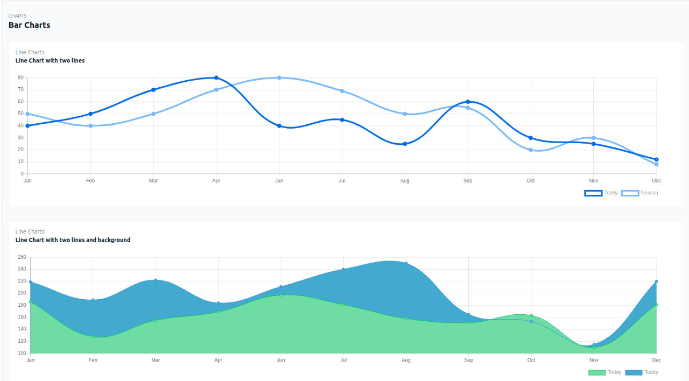

<h1 align="center">
    
</h1>

  <a href="#rocket-tecnologias">Tecnologias</a>&nbsp;&nbsp;&nbsp;|&nbsp;&nbsp;&nbsp;
  <a href="#-projeto">Projeto</a>&nbsp;&nbsp;&nbsp;&nbsp;&nbsp;&nbsp;

[comment]: <> (Video GIF)

 

<h2 align="center">Prévia de Componentes</h2>
 

  

    <h3 align="start">HomePage</h3>
    
  

  

    <h3 align="start">Social Feed</h3>
    
  

  

    <h3 align="start">Switches</h3>
    
  

  

    <h3 align="start">Bar Chart</h3>
    
  

  

    <h3 align="start">Line Chart</h3>
    
  

  

    <h3 align="start">Radar Chart</h3>
    
  

## 👨🏼‍💻 Desenvolvedor

- [Ítalo Henrique](https://www.linkedin.com/in/italo-tech/)

## :rocket: Tecnologias

Esse projeto foi desenvolvido com as seguintes tecnologias:

- [Vue.js](https://vuejs.org/)
- [Tailwindcss](https://tailwindcss.com/docs)

## 💻 Projeto

O D-BOARD é um Dashboard que visa informar métricas específicas com gráficos e principalmente treinar todo seu layout utilizando Tailwincss.

## Passos para utilizar
1. Faça um clone desse repositório;
2. Entre na pasta `cd D-BOARD`;

## Como rodar o projeto?
Após baixar o projeto, acesse ele via seu terminal rode os comandos:

Rode `yarn install` para instalar as dependências;
 
Rode `yarn start` para iniciar a aplicação;
